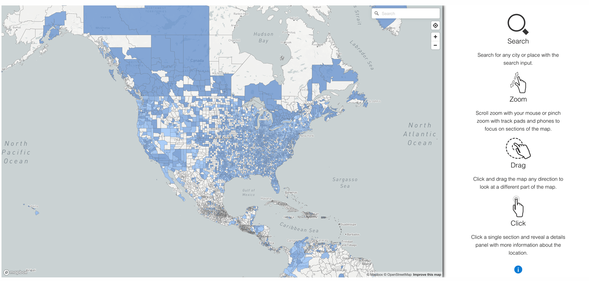
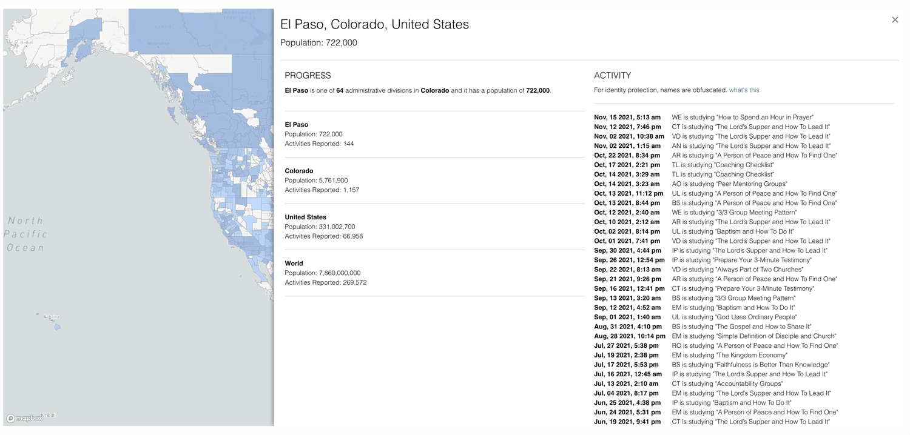
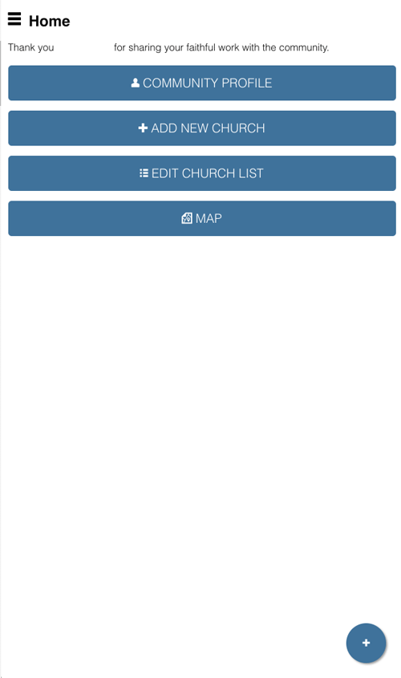
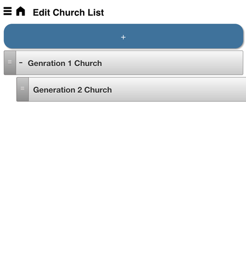

# Zúme - Public Heatmap

Add public & private saturation heat maps for Activity, Practitioners, Trainings, and new Churches, as well as add a reporting portal to every contact so that they can self report on status and church planting progress.

## Purpose

Expand Disciple Tools' ability to communicate progress and collect progress from key contacts.

## Usage

#### Will Do

- The measurement for the saturation statistics is 1 practitioner and 2 churches for every 5,000 in the US and 50k for the world.
- Adds magic links for public map display
- Adds a reporting portal that allows a contact to edit the contact's personal details and report churches generationally.

## Requirements

- Disciple.Tools Theme installed on a Wordpress Server

## Installing

- Install as a standard Disciple.Tools/Wordpress plugin in the system Admin/Plugins area.
- Requires the user role of Administrator.

## Contribution

Contributions welcome. You can report issues and bugs in the
[Issues](https://github.com/viktorsheep/zume-public-heatmaps/issues) section of the repo. You can present ideas
in the [Discussions](https://github.com/viktorsheep/zume-public-heatmaps/discussions) section of the repo. And
code contributions are welcome using the [Pull Request](https://github.com/viktorsheep/zume-public-heatmaps/pulls)
system for git. For a more details on contribution see the
[contribution guidelines](https://github.com/viktorsheep/zume-public-heatmaps/blob/master/CONTRIBUTING.md).

## Screenshots
Saturation Map Screen

Saturation Map - Saturation Measurement Panel

Report Home (mobile first, magic link)

Report Menu (mobile first, magic link)

Report New Church Editor

